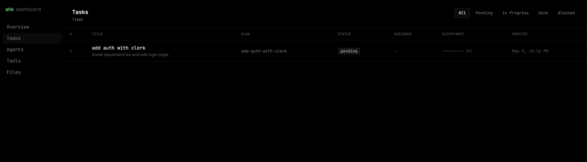

# @cardor/agent-harness-kit

**A provider-agnostic scaffolding kit for running structured multi-agent workflows in your codebase.**


[](https://snyk.io/test/npm/@cardor/agent-harness-kit)

Instead of letting AI agents roam freely through your project with no memory, no coordination, and no audit trail, agent-harness-kit gives them a shared structure: a task backlog, a defined workflow, a persistent log of every action taken, and a health gate that must be green before any work begins.

You stay in control. The agents stay on track.

Visit the [website](https://stack.cardor.dev/ahk) to view a full explanation, examples, and other tools!

<a href='https://ko-fi.com/S6S31ZBGQK' target='_blank'></a>

```bash
npx ahk init
```

---

## Table of Contents

- [@cardor/agent-harness-kit](#cardoragent-harness-kit)
  - [Table of Contents](#table-of-contents)
  - [Why this exists](#why-this-exists)
  - [How it works](#how-it-works)
  - [Features](#features)
  - [Requirements](#requirements)
  - [Installation](#installation)
  - [Commands](#commands)
    - [`ahk init`](#ahk-init)
    - [`ahk build`](#ahk-build)
    - [`ahk dashboard`](#ahk-dashboard)
    - [`ahk status`](#ahk-status)
    - [`ahk health`](#ahk-health)
    - [`ahk sync`](#ahk-sync)
    - [`ahk serve`](#ahk-serve)
    - [`ahk task add`](#ahk-task-add)
    - [`ahk task list`](#ahk-task-list)
    - [`ahk task done <id|slug>`](#ahk-task-done-idslug)
    - [`ahk reset`](#ahk-reset)
    - [`ahk migrate`](#ahk-migrate)
    - [`ahk export`](#ahk-export)
  - [Files created by `ahk init`](#files-created-by-ahk-init)
    - [What each file does](#what-each-file-does)
  - [What you can customize](#what-you-can-customize)
    - [`agent-harness-kit.config.ts`](#agent-harness-kitconfigts)
    - [`health.sh`](#healthsh)
    - [Agent definition files](#agent-definition-files)
    - [`.harness/feature_list.json`](#harnessfeature_listjson)
  - [MCP tools (for agents)](#mcp-tools-for-agents)
  - [Agent roles](#agent-roles)
  - [What to commit](#what-to-commit)
  - [Runtime compatibility](#runtime-compatibility)
  - [Contributing \& local development](#contributing--local-development)
    - [Testing the local build in another project](#testing-the-local-build-in-another-project)
  - [Roadmap](#roadmap)

---

## Why this exists

If you don't know what is Agent Harness, you can check this blog post: [Introducing Agent Harness](https://aakashgupta.medium.com/2025-was-agents-2026-is-agent-harnesses-heres-why-that-changes-everything-073e9877655e).

Most AI coding tools give you a single agent with a chat window. That works for small tasks. It breaks down when:

- You want multiple specialized agents working in sequence (plan → explore → build → review)
- You need to track what changed, what was tried, and what was blocked — across sessions
- You switch between AI providers (Claude Code today, OpenCode tomorrow) and don't want to re-setup everything
- You want a health check that agents must pass before touching code

agent-harness-kit solves all of this with a thin layer of scaffolding and a local MCP server that any MCP-compatible AI tool can connect to.

---

## How it works

```
ahk init
  └── creates config, agent definitions, task backlog, health check

AI tool opens your project
  └── reads .claude/mcp.json, opencode.json, or .codex/config.toml
  └── spawns: npx ahk serve (stdio MCP server)

Agent starts working
  └── tasks.get()         → picks a task from the backlog
  └── tasks.claim(id)     → atomically claims it (no double-work)
  └── actions.start()     → registers its action
  └── actions.write()     → logs sections: result, files, blockers…
  └── actions.complete()  → closes the action

Lead → Explorer → Builder → Reviewer
  └── each role has its own agent definition with clear responsibilities
  └── the harness DB records the full history
```

Everything is stored locally in a SQLite database (`.harness/harness.db`). No cloud, no external services, no API keys required beyond what your AI tool already uses.

---

## Features

- **Provider-agnostic** — works with Claude Code, OpenCode, Codex CLI, or any MCP-compatible AI tool. Switch providers without losing your task history or reconfiguring your workflow.
- **Structured 4-agent workflow** — Lead, Explorer, Builder, and Reviewer each have defined responsibilities and can only act within their role.
- **Atomic task claiming** — agents use `tasks.claim()` which uses a SQLite transaction to prevent two agents from picking up the same task at the same time.
- **Full audit trail** — every action, file touched, tool used, and section written is stored in SQLite and queryable.
- **Health gate** — agents must run `health.sh` and get a green exit before starting or closing any task. You define what "healthy" means.
- **Markdown fallback** — `current.md` is always regenerated so agents can understand the session state even without the MCP server.
- **Docs search** — agents can call `docs.search(query)` to find relevant content in your project's docs folder before writing code.
- **Multi-database support** — SQLite by default (zero native deps, uses `node:sqlite` on Node ≥ 22 or `bun:sqlite` on Bun). Switch to PostgreSQL or MySQL with a single config line — same schema, same MCP tools, same workflow.
- **Incremental scaffold** — `ahk init` and `ahk build` never overwrite files you've customized. Agent definitions you've edited are preserved.
- **Global installation** — `ahk init` can scaffold the harness into your home directory (`~/.claude` or `~/.config/opencode`) to share it across all projects.
- **Input validation** — CLI prompts validate all inputs (name length, path format, task title, etc.) and retry with the error message instead of silently accepting bad values.

---

## Requirements

- Node.js ≥ 22.5 **or** Bun (any recent version)
- npm ≥ 9

---

## Installation

```bash
# Install in your project as a dev dependency
npm install --save-dev @cardor/agent-harness-kit

# Or globally
npm install -g @cardor/agent-harness-kit
```

Then run the interactive setup inside your project:

```bash
npx ahk init
# or, if installed globally:
ahk init
```

---

## Commands

### `ahk init`

Interactive scaffold. Asks for your project name, description, AI provider, whether to install globally, docs path, task adapter, and an optional first task. Creates all harness files in the current directory (or home directory if global).

```bash
ahk init

# Skip prompts with flags
ahk init --name "my-app" --provider claude-code --docs ./docs --tasks local
ahk init --name "my-app" --provider codex-cli   --docs ./docs --tasks local
```

Run this once per project. Safe to re-run — it will not overwrite files you've customized.

**Global installation** — if you answer yes to "Install globally?", files go to `~/.claude` (Claude Code), `~/.config/opencode` (OpenCode), or `~/.codex` (Codex CLI). This lets you share one harness config across all your projects.

---

### `ahk build`

Regenerates `AGENTS.md` and provider-specific files from your `agent-harness-kit.config.ts`. Use this after changing config values.

```bash
ahk build
ahk build --watch    # watch mode: rebuilds automatically on config changes
```

---

### `ahk dashboard`

Opens a local web dashboard to visualize everything stored in the harness database — tasks, agent actions, file operations, tool usage, and live timelines. Updates in real time via WebSocket as agents work.

```bash
ahk dashboard                  # opens http://localhost:4242 in your browser
ahk dashboard --port 8080      # custom port
ahk dashboard --no-open        # start server without opening browser
```

The dashboard includes:

| View            | What it shows                                                               |
| --------------- | --------------------------------------------------------------------------- |
| **Overview**    | Status counts, active tasks with acceptance progress, recent agent activity |
| **Tasks**       | Full task list, filterable by status, with acceptance progress bars         |
| **Task detail** | Acceptance criteria, action timeline per agent, files touched, tools used   |
| **Agents**      | Per-role breakdown: actions, tasks worked, files touched, completion rate   |
| **Tools**       | Top tools bar chart + full log of recent tool calls with args and results   |
| **Files**       | Most-touched files with operation breakdown + recent file operation log     |



---

### `ahk status`

Shows the current task table and any active agent actions in the terminal.

```bash
ahk status
ahk status --json    # machine-readable output
```

---

### `ahk health`

Runs `health.sh` and reports the result. Exit 0 = healthy, exit 1 = something is wrong.

```bash
ahk health
```

---

### `ahk sync`

Syncs `.harness/feature_list.json` ↔ SQLite. Tasks already in the DB are skipped by slug. Use this to seed the backlog from the JSON file without duplicating existing tasks.

```bash
ahk sync                         # both directions (default)
ahk sync --direction in          # JSON → SQLite only
ahk sync --direction out         # SQLite → JSON only
ahk sync --dry-run               # preview changes without applying them
ahk sync --dry-run --direction in
```

---

### `ahk serve`

Starts the MCP server on stdio. **You never need to call this manually.** After `ahk init`, the generated `.claude/mcp.json` (Claude Code) or `opencode.json` (OpenCode) tells the AI tool to spawn it automatically when you open the project.

```bash
ahk serve
ahk serve --port 3456    # store a port hint in config (stdio transport only)
```

---

### `ahk task add`

Interactively adds a new task to the backlog (SQLite + `feature_list.json`).

```bash
ahk task add
```

---

### `ahk task list`

Lists all tasks. Optionally filter by status.

```bash
ahk task list
ahk task list --status pending
ahk task list --status in_progress
ahk task list --status done
ahk task list --status blocked
ahk task list --json             # machine-readable output
```

---

### `ahk task done <id|slug>`

Marks a task as done. Runs the health check first if health is required — if it fails, the task is not closed.

```bash
ahk task done 3
ahk task done add-auth-flow
```

---

### `ahk reset`

Clears harness data interactively. Only SQLite databases are managed by this command — remote Postgres/MySQL databases are intentionally skipped.

```bash
ahk reset                          # interactive — asks before deleting each item
ahk reset --force                  # skip all confirmation prompts
ahk reset --provider claude-code   # also delete agent files for this provider
ahk reset --provider opencode
ahk reset --provider codex-cli
```

What it can reset:

- The SQLite `.db` file (plus WAL and SHM files if present)
- `.harness/feature_list.json`
- Agent definition files in `.claude/agents/`, `.opencode/agents/`, or `.codex/agents/`

After a reset, run `ahk init` to scaffold a fresh harness.

---

### `ahk migrate`

Migrates provider-specific files from one AI provider to another. Useful when switching from Claude Code to OpenCode or vice versa.

```bash
ahk migrate --to opencode
ahk migrate --to claude-code
ahk migrate --to codex-cli
```

---

### `ahk export`

Exports the full database as JSON or SQL. Useful for backups, external reporting, or migrating data.

```bash
ahk export --json                        # JSON to stdout
ahk export --json --output snapshot.json # JSON to file
ahk export --sql                         # SQL dump to stdout
ahk export --sql --output dump.sql       # SQL dump to file
```

---

## Files created by `ahk init`

**Claude Code** (`provider: 'claude-code'`):

```
your-project/
├── agent-harness-kit.config.ts
├── AGENTS.md
├── CLAUDE.md
├── health.sh
├── .harness/
│   ├── harness.db                 ← gitignored
│   ├── current.md                 ← gitignored
│   └── feature_list.json
└── .claude/
    ├── agents/
    │   ├── lead.md
    │   ├── explorer.md
    │   ├── builder.md
    │   └── reviewer.md
    ├── mcp.json                   ← MCP server registration
    └── settings.json              ← sets `agent: "lead"` as the default session agent
```

**OpenCode** (`provider: 'opencode'`):

```
your-project/
├── agent-harness-kit.config.ts
├── AGENTS.md
├── health.sh
├── opencode.json                  ← MCP server + default_agent + compaction config
├── .harness/
└── .opencode/
    └── agents/
        ├── lead.md
        ├── explorer.md
        ├── builder.md
        └── reviewer.md
```

**Codex CLI** (`provider: 'codex-cli'`):

```
your-project/
├── agent-harness-kit.config.ts
├── AGENTS.md
├── health.sh
├── .harness/
└── .codex/
    ├── config.toml                ← MCP server registration
    └── agents/
        ├── lead.toml
        ├── explorer.toml
        ├── builder.toml
        ├── reviewer.toml
        └── default.toml           ← overrides Codex's built-in default agent → routes to lead
```

### What each file does

| File                          | Purpose                                                                               | Edit it?                                                    |
| ----------------------------- | ------------------------------------------------------------------------------------- | ----------------------------------------------------------- |
| `agent-harness-kit.config.ts` | Defines project metadata, provider, storage paths, MCP port                           | Yes — it's yours                                            |
| `AGENTS.md`                   | Navigation map agents read first. Regenerated by `ahk build`                          | No — changes will be overwritten                            |
| `health.sh`                   | Shell script agents run before starting work. Must exit 0                             | **Yes — implement your checks here**                        |
| `.harness/feature_list.json`  | Task backlog in JSON. Humans edit this, `ahk sync` loads it into SQLite               | Yes — add tasks here                                        |
| `.harness/harness.db`         | SQLite database. Source of truth for tasks, actions, sections                         | No — managed by the harness                                 |
| `.harness/current.md`         | Auto-generated session snapshot for agents without MCP access                         | No — regenerated automatically                              |
| `.claude/agents/*.md`         | Agent role definitions (Claude Code). Created once, never overwritten                 | **Yes — customize agent behavior**                          |
| `.claude/mcp.json`            | MCP server registration for Claude Code. Merged by `ahk build`                        | Yes, carefully — don't remove the `agent-harness-kit` entry |
| `.claude/settings.json`       | Sets `agent: "lead"` so lead runs as the default session agent. Merged by `ahk build` | Yes, carefully                                              |
| `.opencode/agents/*.md`       | Agent role definitions (OpenCode). Created once, never overwritten                    | **Yes — customize agent behavior**                          |
| `opencode.json`               | MCP server + `default_agent` + compaction config for OpenCode. Merged by `ahk build`  | Yes, carefully                                              |
| `.codex/agents/*.toml`        | Agent role definitions (Codex CLI). Created once, never overwritten                   | **Yes — customize agent behavior**                          |
| `.codex/config.toml`          | MCP server registration for Codex CLI. Merged by `ahk build`                          | Yes, carefully                                              |

---

## What you can customize

### `agent-harness-kit.config.ts`

Everything in the config file is yours to change:

```ts
import { defineHarness } from '@cardor/agent-harness-kit'

export default defineHarness({
  project: {
    name: 'My App',
    description: 'What this project does',
    docsPath: './docs', // where agents search for documentation
  },

  provider: 'claude-code', // 'claude-code' | 'opencode' | 'codex-cli'

  agents: {
    lead: { instructionsPath: null },
    explorer: { instructionsPath: null, allowedPaths: ['./docs', './src'] },
    builder: { instructionsPath: null, writablePaths: ['./src', './tests'] },
    reviewer: { instructionsPath: null },
    custom: [], // define extra agents here
  },

  // ── Database ──────────────────────────────────────────────────────────────
  // SQLite (default — zero native deps, Node 22+ or Bun)
  database: { type: 'sqlite', path: '.harness/harness.db' },

  // PostgreSQL — uncomment to use instead:
  // database: { type: 'postgres', connectionString: process.env.DATABASE_URL },

  // MySQL — uncomment to use instead:
  // database: { type: 'mysql', connectionString: process.env.DATABASE_URL },

  storage: {
    dir: '.harness',
    tasks: { adapter: 'local' }, // 'local' | 'jira' | 'linear' | 'mcp'
    sections: {
      toolsUsed: true, // log which tools agents used
      filesModified: true, // log which files were touched
      result: true, // log action results
      blockers: true, // log blockers agents hit
      nextSteps: false, // optional next steps field
    },
    markdownFallback: { enabled: true, path: '.harness/current.md' },
  },

  health: {
    scriptPath: './health.sh',
    required: true, // set to false to skip health checks
  },

  tools: {
    mcp: { enabled: true, port: 3742 },
    scripts: { enabled: true, outputDir: './.harness/scripts' },
  },
})
```

### `health.sh`

This is the most important file to implement. Agents will not start or close tasks until this script exits 0. Examples:

```bash
#!/usr/bin/env bash

# Check the dev server is up
curl -sf http://localhost:3000/health > /dev/null || exit 1

# Run unit tests
npm test || exit 1

# Check DB connection
psql "$DATABASE_URL" -c "SELECT 1" > /dev/null 2>&1 || exit 1

echo "All checks passed."
```

### Agent definition files

Created once and **never overwritten** by `ahk build` — your edits are permanent.

**Claude Code** (`.claude/agents/*.md`) and **OpenCode** (`.opencode/agents/*.md`) use Markdown with YAML frontmatter:

```markdown
---
name: builder
description: Builder agent — implements the plan produced by explorer and lead
tools:
  read: true
  write: true
  edit: true
  bash: true
permissionMode: acceptEdits
---

# Builder Agent

You are the builder agent for MyApp. Follow these rules:

- All API endpoints must be defined in `src/routes/`
- Never modify `src/core/` without lead approval
- Run `npm test` after every change and fix failures before completing
- Use the existing error handling pattern from `src/lib/errors.ts`
```

**Codex CLI** (`.codex/agents/*.toml`) uses TOML format:

```toml
name = "builder"
sandbox_mode = "workspace-write"

description = """
Builder agent — implements the plan produced by explorer and lead.
"""

developer_instructions = """
# Builder Agent

You are the builder agent for MyApp. Follow these rules:

- All API endpoints must be defined in `src/routes/`
- Never modify `src/core/` without lead approval
- Run `npm test` after every change and fix failures before completing
"""
```

The `sandbox_mode` field controls Codex's filesystem permissions per agent: `"read-only"` for lead, explorer, and reviewer; `"workspace-write"` for builder. The `permissionMode` field in Claude Code agent files enforces the same constraints at the session level (`plan` for read-only roles, `acceptEdits` for builder).

### `.harness/feature_list.json`

The human-editable task backlog. Add tasks here, then run `ahk sync` to load them into SQLite.

```json
[
  {
    "slug": "add-auth-flow",
    "title": "Add JWT authentication flow",
    "description": "Implement login, refresh token, and logout endpoints",
    "acceptance": [
      "POST /auth/login returns a signed JWT",
      "POST /auth/refresh validates and rotates the token",
      "All protected routes return 401 without a valid token",
      "Tests cover happy path and token expiry"
    ]
  }
]
```

Good acceptance criteria make the difference — the reviewer agent uses them to decide whether to approve or block a task.

---

## MCP tools (for agents)

The harness exposes these tools via MCP. Agents use them instead of reading files directly.

| Tool                      | Parameters                                      | Description                                                                                                                                             |
| ------------------------- | ----------------------------------------------- | ------------------------------------------------------------------------------------------------------------------------------------------------------- |
| `tasks.get`               | `status?`                                       | List tasks, optionally filtered by `pending \| in_progress \| done \| blocked`                                                                          |
| `tasks.claim`             | `id, agent`                                     | Atomically claim a pending task. Returns `task_already_claimed` if another agent got it first                                                           |
| `tasks.update`            | `id, status`                                    | Change task status                                                                                                                                      |
| `tasks.add`               | `title, slug?, description?, acceptance?`       | Create a new task directly from MCP (agents can queue work on the fly)                                                                                  |
| `tasks.acceptance.update` | `criterionId`                                   | Mark an acceptance criterion as met. Criterion IDs come from `tasks.get`                                                                                |
| `actions.start`           | `taskId, agent`                                 | Start a new action, returns `actionId`                                                                                                                  |
| `actions.write`           | `actionId, sectionType, content`                | Record a text section: `result \| tools_used \| blockers \| next_steps`. Does **not** populate the Files dashboard — use `actions.record_file` for that |
| `actions.complete`        | `actionId, summary`                             | Close an action with a one-line summary                                                                                                                 |
| `actions.get`             | `taskId`                                        | Full action history for a task (all agents, all sections)                                                                                               |
| `actions.record_file`     | `actionId, filePath, operation, notes?`         | Register a file touch. The **only** way to populate the Files dashboard. `operation`: `read \| created \| modified \| deleted`                          |
| `actions.record_tool`     | `actionId, toolName, argsJson?, resultSummary?` | Register a tool call. The **only** way to populate the Tools dashboard                                                                                  |
| `docs.search`             | `query`                                         | Search the `docsPath` folder for content matching the query                                                                                             |

---

## Agent roles

| Role         | Responsibility                                                                                    |
| ------------ | ------------------------------------------------------------------------------------------------- |
| **lead**     | Decomposes the task into a plan, assigns sub-agents. Does not write code or read source files.    |
| **explorer** | Reads and maps the codebase. Never writes files. Records every file read.                         |
| **builder**  | Implements the plan. Only writes to `writablePaths`. Records every file modified.                 |
| **reviewer** | Verifies all acceptance criteria are met. Approves or blocks. Runs health check before approving. |

---

## What to commit

| File                          | Commit?             |
| ----------------------------- | ------------------- |
| `agent-harness-kit.config.ts` | Yes                 |
| `AGENTS.md`                   | Yes                 |
| `CLAUDE.md`                   | Yes                 |
| `health.sh`                   | Yes                 |
| `.harness/feature_list.json`  | Yes                 |
| `.claude/agents/*.md`         | Yes                 |
| `.claude/mcp.json`            | Yes                 |
| `.claude/settings.json`       | Yes                 |
| `.opencode/agents/*.md`       | Yes                 |
| `opencode.json`               | Yes                 |
| `.codex/agents/*.toml`        | Yes                 |
| `.codex/config.toml`          | Yes                 |
| `.harness/harness.db`         | **No** (gitignored) |
| `.harness/current.md`         | **No** (gitignored) |

The rule: commit inputs (config, task definitions, agent instructions). Ignore outputs (DB, auto-generated snapshots).

---

## Runtime compatibility

| Runtime          | SQLite                         | PostgreSQL                | MySQL                   |
| ---------------- | ------------------------------ | ------------------------- | ----------------------- |
| Node.js ≥ 22     | ✅ uses `node:sqlite` built-in | ✅ via `postgres` package | ✅ via `mysql2` package |
| Bun (any recent) | ✅ uses `bun:sqlite` built-in  | ✅ via `postgres` package | ✅ via `mysql2` package |
| Node.js < 22     | ❌ `node:sqlite` not available | ✅                        | ✅                      |

SQLite requires no additional packages. For PostgreSQL install `postgres`, for MySQL install `mysql2`:

```bash
npm install postgres    # for PostgreSQL
npm install mysql2      # for MySQL
```

---

## Contributing & local development

```bash
git clone <repo-url>
cd agent-harness-kit
npm install

npm run build:ui    # build the dashboard SPA (dashboard/ → src/dashboard-dist/)
npm run build       # build:ui + tsc + copy-assets
npm run dev         # watch mode (CLI TypeScript only)
npm test            # run tests
```

### Testing the local build in another project

Use the helper script to build the package and link it into any local project in one step:

```bash
# Build + link into a specific project
./scripts/link-local.sh /path/to/your-other-project

# Build + register globally only (then link manually wherever you need)
./scripts/link-local.sh
```

What the script does:

1. Runs `npm run build` (full build including dashboard assets)
2. Runs `npm link` to register the package globally on your machine
3. Runs `npm link @cardor/agent-harness-kit` inside the target project
4. Smoke-tests the `ahk` binary with `--version`

After linking, `npx ahk` inside the target project will use your local build. To unlink when you're done:

```bash
# Inside the target project
npm unlink @cardor/agent-harness-kit

# Optionally remove the global registration
npm uninstall -g @cardor/agent-harness-kit
```

> **Tip:** If you're iterating quickly, run `npm run build` in this repo after each change — the link picks up the new `dist/` immediately without re-running the script.

To work on the dashboard UI with hot reload:

```bash
# Terminal 1 — CLI server (no browser open)
cd your-test-project && ahk dashboard --no-open --port 4242

# Terminal 2 — Vite dev server with HMR
cd dashboard && npm run dev   # http://localhost:5173, proxies /api and /ws → :4242
```

Commit messages follow [Conventional Commits](https://www.conventionalcommits.org/) with a required scope:

```
feat(cli): add export command
fix(db): prevent race condition in claimTask
chore(ci): update Node version to 22
```

Types: `feat fix chore refactor docs test perf style build ci revert`

---

## Roadmap

- ✅ **`ahk dashboard`** — local web UI with real-time WebSocket updates. Shows tasks, action timelines, file activity, tool usage, and per-agent breakdowns.
- ✅ **`ahk reset`** — interactively clear the SQLite DB, feature list, and agent files to start a project fresh.
- ✅ **PostgreSQL + MySQL drivers** — remote database support via `postgres` and `mysql2` packages. Configure with `database: { type: 'postgres', connectionString: '...' }`.
- ✅ **`actions.record_file` + `actions.record_tool`** — dedicated MCP tools for populating the Files and Tools dashboard views.
- ✅ **`tasks.add` via MCP** — agents can create new tasks on the fly without leaving the conversation.
- ✅ **Global installation** — `ahk init` can install the harness to your home directory, shared across projects.
- ✅ **Input validation** — all CLI prompts validate and retry on bad values.
- ✅ **Codex CLI provider** — full support for OpenAI Codex CLI. Generates `.codex/agents/*.toml` files with proper `sandbox_mode` per role and merges `.codex/config.toml` for MCP registration. Overrides the built-in `default` agent so the harness lead runs by default.
- **Graphify integration** — connect the harness to Graphify to visualize agent workflows, task dependencies, and action timelines as interactive graphs.
- **Open Telemetry integration** — emit OpenTelemetry spans for all agent actions, file operations, and tool calls.
- **Jira task adapter** — pull tasks directly from Jira instead of maintaining `feature_list.json` manually.
- **Linear task adapter** — same as Jira, for Linear.
- **GitHub Issues adapter** — same, for GitHub Issues.
- **Remote MCP adapter** — connect to a hosted MCP server instead of a local SQLite file. Enables shared task state across machines and team members without syncing a DB file.
